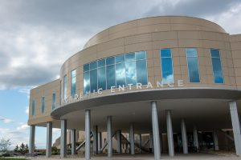

# Hackathon 2019

[Website at the Center for Quantitative Medicine](https://health.uconn.edu/quantitative-medicine/hackathon-2019/)

Contact us: [Kate Hayden](mailto:khayden@uchc.edu)

[**Registration**](https://www.emailmeform.com/builder/form/4mco5B1a84F2)

## Office of Health Strategy Medication Reconciliation Hackathon at UConn Health

### At a Glance

**Who?**

Hackathon Target Participants:

- Prescribing clinicians
- Pharmacists
- Analysts
- Informaticians
- Software engineers
- Developers & programmers
- Students in medicine, pharmacy & engineering
- Patient advocates

**When?**

Friday April 5th & Saturday 6th 2019

**Where?**

Academic Entrance\
UConn Health, 263 Farmington Ave, Farmington, CT 06030

**Cost?**

Free

### Purpose

- Increase awareness of Medication Reconciliation (Med Rec) challenges
- Increase awareness of how a Health Information Exchange (HIE) in CT might facilitate effective, efficient and user-friendly Med Rec
- Refine a Med Rec Use Case
- Education and experience in Health IT standards such as Fast Healthcare Interoperability Resources (FHIR) and Substitutable Medical Applications, Reusable Technologies (SMART) on FHIR
- Development of a simple diagrammatic and software prototype

### Planning Committee

[**Thomas P. Agresta MD, MBI**](http://facultydirectory.uchc.edu/profile?profileId=Agresta-Thomas)\
Professor and Director of Medical Informatics Family Medicine at UConn Health
Director of Clinical Informatics - Center for Quantitative Medicine
Section Leader for Informatics Connecticut Institute for Primary Care Innovation

[**Bruce Metz, PhD**](https://health.uconn.edu/about/leadership)\
Vice President and Chief Information Officer at Uconn Health

[**Steve A. Demurjian, PhD**](http://www.engr.uconn.edu/~steve)\
Professor Computer Science & Engineering Department at the University of Connecticut

[**Robert Hausam, MD**](https://twitter.com/rhausam)\
Consultant/Owner Hausam Consulting LLC

[**Philip A. Smith, MD, MS**](https://www.medmorph.com/about/)\
President at MedMorph LLC
Author, Med Wreck: Proposing a Solution for the Nightmare of Medication Reconciliation?

[**John DeStefano, BSP, MBA**](https://smcpartners.com/about-us/leadership-team/)\
Director of Innovation and HIE at SMC Partners, LLC

[**Sabina Sitaru**](https://twitter.com/sabinasitaru?lang=en)\
Interim Chief Operating Officer Health Information Exchange Entity

## Agenda

All sessions will take place at UConn Health - Academic Building at 263 Farmington Ave, Farmington, Connecticut. Listed below is the draft schedule for the conference:

**Friday April 5th 2019**

- 8:00 AM - 8:30 AM Check-in & breakfast (provided)
- 8:30 AM - 11:45 AM Lecture
  - 8:30 AM - 9:00 AM Introductory Remarks
  - 9:00 AM - 9:45 AM Background - CancelRx, Office of Health Strategy (OHS) Medication Reconciliation & Polypharmacy (MRP) Workgroup, Funding opportunities, Goals for event and long-term outcomes with some examples
  - 9:45 AM - 10:45 AM Current State of Affairs - “Medication Wreck”
  - 10:45 AM - 11:45 AM Discussion of Technical Solutions - How Fast Healthcare Interoperability Resources (FHIR) can be a game changer – with examples of recent work
- 11:45 AM - 12:30 PM Lunch (provided)
- 12:30 PM - 2:30 PM Split into Workshops
  - Clinician / Administrator group / Patient advocate
    - Review and decide on simple requirements from Med Rec Use Case as developed by OHS MRP group.
    - Develop Med Rec storyboards
  - Programmer / Developer / Informatics
    - Review FHIR resources, FHIR-Pilot Interoperability Test Bed (PIT), examples of code
    - Practice development with simple pre-built scripts to pull several meds
- 2:30 PM - 5:00 PM Formation of Teams to work on prototypes
  - Focus on a variety of medication list users (within an EHR, Patient facing Mobile APP and/or Pharmacy System)
  - Focus on one end-user system but work on different components

**Saturday April 6th 2019**

- 8:00 AM - 8:15 AM Check-in & breakfast (provided)
- 8:15 AM - 12:00 PM Continue Team based prototype development
- 12:00 PM - 12:45 PM – Lunch (provided)
- 12:45 PM - 4:00 PM Team demonstration of prototypes developed and explanation about lessons learned
- 4:00 PM - 5:00 PM Group discussion
- 5:00 PM Reception

## Travel Information

### Driving Directions

_UConn Health, 263 Farmington Avenue, Farmington, CT 06030_ will bring you directly to the main entrance of UConn Health. **Please note the event will be in the Academic Area of the main building but parking directions are different on Friday April 5th and Saturday April 6th 2019.** Registration opens at 8am.
**When you arrive, please follow signs for Hackathon Event Directions/Parking.**

### Parking

**Friday, April 5th 2019**\
From our main entrance at 263 Farmington Avenue, proceed to the roundabout and take the third exit and follow signs for Hackathon/ Event parking. UConn Health has both the medical and dental schools on their campus. Due to Friday being a school day, and to the volume of patients, parking has been assigned to **Garage 1- Level 4**. Please use the garage elevator to get to Level 6 and walk to the sidewalk shuttle area. A LAZ shuttle will be going to and from this location to the **Main Building – Academic Entrance**. Registration/Check-in will be right inside the doors. **Please take a parking validation ticket at the time of check-in to use when exiting the parking garage so that it is free of charge to you.**

**Saturday April 6th 2019**\
From our main entrance at 263 Farmington Avenue, proceed to the roundabout and take your second right onto Academic Rd (not left toward the main entrance) to our Upper Campus. Head up the hill, past the emergency room, and the Academic Entrance will be on your left. There will be a parking attendant directing traffic to the free lots there.

[**Parking Map (PDF)**](https://health.uconn.edu/park/wp-content/uploads/sites/64/2018/03/Health-Visitor-Only-Parking-Map.pdf)

### Recommended Accommodations

[**Homewood Suites by Hilton Hartford-Farmington**](https://homewoodsuites3.hilton.com/en/hotels/connecticut/homewood-suites-by-hilton-hartford-farmington-HFDFMHW/index.html)\
2 Farm Glen Boulevard\
Farmington, Connecticut, 06032, USA\
TEL: +1-860-321-0000

Spacious one-bedroom or two-bedroom suites feature separate living and sleeping areas. Each suite is large enough for work, study, or entertaining and includes a kitchen with a full-sized refrigerator, microwave, and coffeemaker. Relax on a comfortable couch in your living room, and unwind in front of on-demand movies on your TV. Stay connected with high-speed WiFi or work from the desk. Free shuttle service is available.

[**The Farmington Inn**](http://www.farmingtoninn.com/)\
827 Farmington Avenue\
Farmington, Connecticut, 06032, USA\
TEL: +1-860-677-2821

Standard room amenities  include complimentary wireless internet access, individual temperature control units, televisions with full cable and DVD/VCR (available upon request), in-room voicemail system, dataport equipped telephones, digital clock radio, iron and ironing boards, hairdryers, and a spacious work desk area. The Farmington Inn is about 2 miles away from conference venue.

### Airport

[Bradley International Airport (BDL)](http://www.bradleyairport.com/) is the closest public airport located to Farmington, CT. The airport located in Windsor Locks, Connecticut, is a 35 minute drive by car. The airport is the second-largest airport in New England after Boston's Logan International Airport and Connecticut's busiest commercial airport with 350 daily operations. The four largest carriers at Bradley International Airport are Southwest Airlines, Delta Air Lines, JetBlue Airways, and US Airways.
