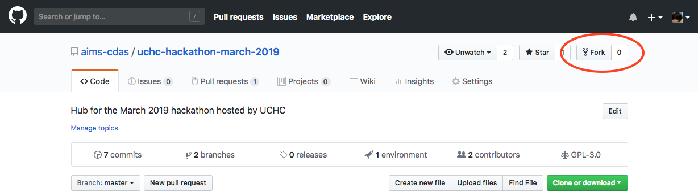

# Using Git and GitHub

**Git** is version tracking and control software widely used both by individual developers and by collaborative development teams. **GitHub** is the most popular public code and documentation repository built on Git. Participants in the [2019 MedRec Hackathon](../) can fork this repository ("repo") to build upon the instruction and resources it contains, as explained below.

## Git tutorials

Many excellent Git tutorials exist, e.g. [at the Git website](https://git-scm.com/docs/gittutorial) and [at Atlassian](https://www.atlassian.com/git/tutorials), who maintain Bitbucket. Still, Git often takes a lot of getting used to. Here, we'll cover the bare basics.

## Introduction, installation, and documentation

For a conceptual introduction to Git leading up to installation instructions, begin with [Getting Started](https://git-scm.com/book/en/v2/Getting-Started-About-Version-Control) at the Git website.

The website is a valuable source of thorough documentation, and i (Cory) recommend it as the _second_ step in figuring out how to accomplish something using Git. The _first_ is the software documentation accessible using `--help`:

```command
git --help
git <command> --help
```

The _third_ source i'd recommend is search engines, which usually take me to well-posed questions and comprehensive answers on [StackOverflow](https://stackoverflow.com/).

## Fork and clone the Hackathon repo

To more transparently track and share our work, we ask participants to fork this repository to their own GitHub accounts. Fill out [this page](https://github.com/join) to create a GitHub account if you don't yet have one.

To [fork](https://help.github.com/en/articles/fork-a-repo) this repo to your own copy, click the **Fork** button at the top of the page:

\

This creates a new repository on your account that is connected to, and can be synchronized with, the original.

To work in your fork on your own machine, you need to [clone](https://help.github.com/en/articles/cloning-a-repository) your fork to a local directory. To begin, navigate to the directory where you want to work and use Git in your command line tool:

```command
git clone https://github.com/aims-cdas/uchc-hackathon-march-2019
```

This creates a new directory named `uchc-hackathon-march-2019` containing the contents of the repo, along with its Git history and the repo URL as a tracked [remote](https://git-scm.com/docs/git-remote) called `origin`. You can view remotes using the `remote` command:
```command
git remote
```
(The `-v` (`--verbose`) option is commonly used to also print remote addresses.)

## Branches

When you create or clone a Git repo, you usually start out in the `master` branch, which is the "public-facing" branch people will see when they visit your repository. Developers use [branches](https://git-scm.com/docs/git-branch) to experiment with changes, which can be discarded if fruitless or [merged](https://git-scm.com/docs/git-merge) if fruitful.

As a rule, **make changes in separate branches**. Once you're satisfied with a branch, you can merge it into `master`. Here are the basic commands for working with branches:

Show all branches:
```command
git branch
```

Checkout (switch to) an existing branch:
```command
git checkout experimental
```

Create a new branch and check it out:
```command
git checkout -b new-branch
```

Merge a branch into the current branch:
```command
git merge experimental
```

If different branches include changes to the same files, then merging can get complicated fast. I recommend making every effort to edit any source file in only one branch at a time. (Files rendered from source files, e.g. images from code scripts, are of less concern, but conflicts may still need to be resolved manually.) For a thorough discussion of merge conflict resolution, see [the Git book](https://git-scm.com/book/en/v2/Git-Branching-Basic-Branching-and-Merging).

## Tracking files and committing changes

Git tracks changes to any files not listed in the hidden plain text file `.gitignore` located in the Git repo (hence, to all files if `.gitignore` does not exist). Beware that adding a file to `.gitignore` does not just stop Git from tracking changes to it but stops Git from tracking it altogether. Commonly untracked files include rendered files like images and PDF documents.

If you've made changes to any tracked files since your last commit, you can view them by checking the status of the repo:

```command
git status
```

To add changes to specific files to the index, i.e. in the queue to be committed:
```command
git add <filename>
```

To revert files to their previously committed state, undoing any changes since that commit:
```command
git checkout <filename>
```

To commit the index, creating a new commit in the commit history,
```command
git commit
```
This will prompt you to provide a message describing this commit; to do this in one step, add the `-m '<commit message in quotes>'` option to `git commit`.

To review the commit history:
```command
git log
```

As a rule, **make sure that all tracked changes have been undone or committed before checking out a different branch**.

## `HEAD`

At any given time, the currently active version of the repo corresponds to a reference called [`HEAD`](http://researchhubs.com/post/computing/git/what-is-HEAD-in-git.html). When you switch to a new branch, `HEAD` switches to the most recent commit in that branch. When you commit changes, `HEAD` switches to the commit created by that action. It is also possible to checkout previous commits, which detaches `HEAD`.

## Merging branches

Merging is simple when no conflicts arise. Just first checkout the branch to be merged _into_, then merge in the other branch, say `branch-to-be-merged`:
```command
git merge <branch-to-be-merged>
```

When conflicts _do_ arise, you'll need to deal with them manually. There are a variety of merge tools (described [at StackOverflow](https://stackoverflow.com/questions/137102/whats-the-best-visual-merge-tool-for-git) and [at Atlassian](https://developer.atlassian.com/blog/2015/12/tips-tools-to-solve-git-conflicts/)) built for this purpose, with features that appeal to different developers. To activate the one configured with Git on your machine:
```command
git mergetool
```
