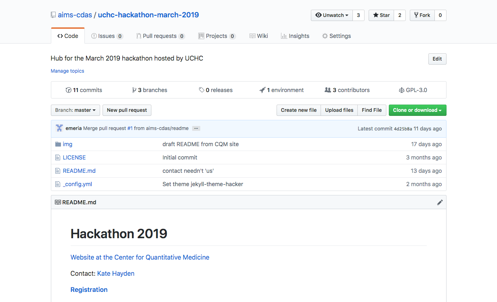
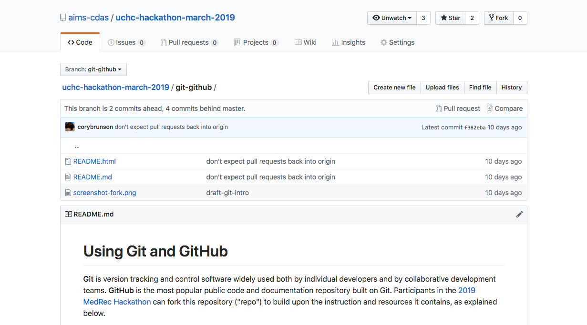
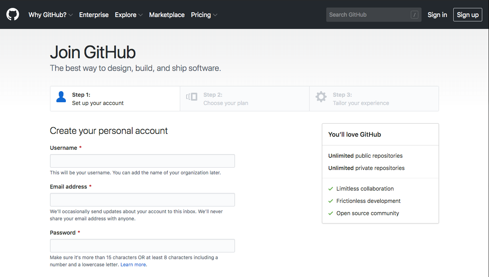
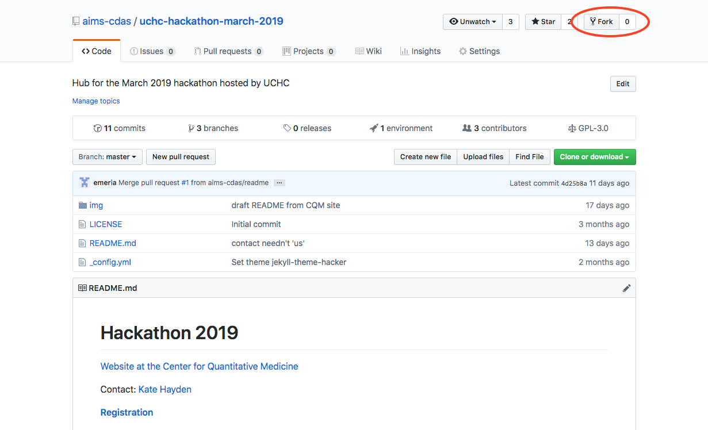
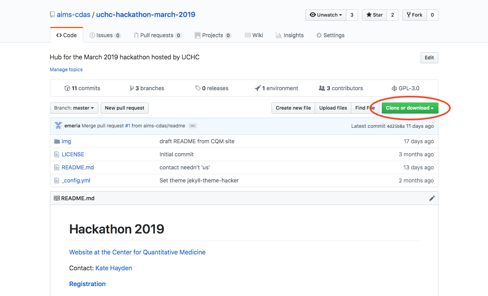
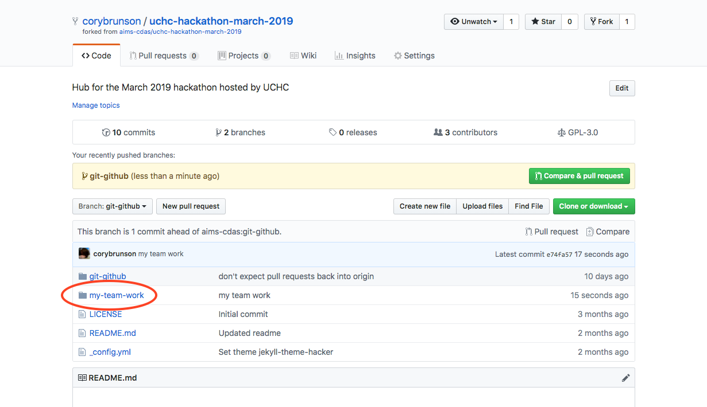

# the MedRec Hackathon GitHub repo

{#id .class width=420}\

\footnotesize
<https://github.com/aims-cdas/uchc-hackathon-march-2019>

# Introduction to Git

{#id .class width=420}\

# Installation

Git introduction:

<https://git-scm.com/book/en/v2/Getting-Started-About-Version-Control>

Git installation (Mac, Windows, source):

<https://git-scm.com/book/en/v2/Getting-Started-Installing-Git>

# Documentation (and help)

1. Git documentation:

    git <command> --help

2. Git Book:

<https://git-scm.com/book/en/v2/>

3. StackOverflow:

<https://stackoverflow.com/>

# Version control with Git

{#id .class width=400}\

# Create a GitHub account

<https://github.com/join>

{#id .class width=420}\

# Fork the MedRec repo

{#id .class width=420}\

# Duplicate the MedRec repo

{#id .class width=420}\

<https://help.github.com/en/articles/duplicating-a-repository>

# Clone your forked copy or private repo

    # clone repo from URL
    git clone \
      https://github.com/<username>/uchc-hackathon-march-2019

    # <navigate into local directory>

    # list remotes linked to local directory
    git remote
    git remote --verbose

# Have Git ignore certain files

Example `.gitignore` file:

    # Mac OS X metadata
    .DS_Store

    # R & RStudio metadata
    .Rhistory
    .Rapp.history
    .RData
    .Rproj.user

    # experimentation folder
    sandbox

# Basic merging

Setup:
\vspace{-8ex}

{#id .class width=360}\

. . .

Merge:
\vspace{-6ex}

{#id .class width=360}\

# Work in a new branch

    # view all branches
    git branch

    # create a new branch
    git branch experimental

    # switch to new branch
    git checkout experimental

# Work in project folders

{#id .class width=420}\

# Stage changes

    # list all tracked changes (committed or not)
    git status

    # add changes to a file to the staging area
    git add <filename>

    # stage any changes to all tracked files
    git add .

    # stop tracking a file (without deleting it)
    git rm --cached <filename>

# Commit staged changes

    # retrieve the last committed version of a file
    # (erase uncommitted changes)
    git checkout <filename>

    # commit staged changes
    git commit --message="this is what i  did"

    # message option shortcut
    git commit -m "this is what i did"

In general, **don't** change branches with uncommitted changes.

# Merge into the master branch

    # switch (back) to the master branch
    git checkout master

    # merge commits from the experimental branch
    git merge experimental

    # open a merge tool to resolve merge conflicts
    git mergetool

# Fin

<!--
pandoc git-slides.md \
-t beamer \
-o git-slides.pdf
-->
